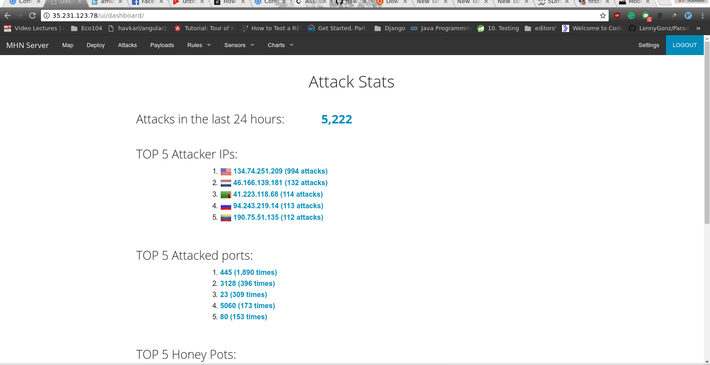

# Project 9 - Honeypot

Time spent: 11 hours spent in total

> Objective: Setup a honeypot and intercept some attempted attacks in the wild

I Used Google cloud platform to deploy the MHN Admin Application.
4 honeypots in total were deployed, they were:
* mhn-honeypot-1-dionaea
* mhn-honeypot-2-elastichoney
* mhn-honeypot-3-shockpot
* mhn-honeypot-4-amun

# Issues encountered
* Installing the MHN Admin application via gloud ssh did not work at all( as instructing by the codepath assignment page)
   most of my time was spent trying to find the issue.

# summary of data collected
* dianaea - over 	3033 attacks
* elastichoney - 1 attack
* shockpot - 0 attacks
* amun - 2188 attacks
* No malware was found in my investigation.

- [ ] Dasboard View: 

# honeymap in action
- [ ] honeymap: 
